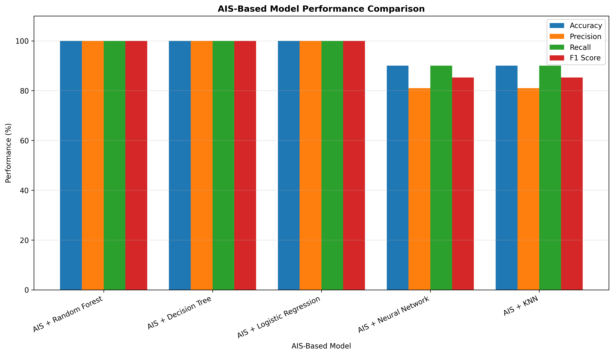

# AI-Based District-Level Electrical Motor Pump Adoption Pattern Analysis

## Overview

This project presents an **AI-based framework for analyzing district-level electrical motor pump adoption patterns** using Machine Learning, Deep Learning, Artificial Immune System (AIS), and Particle Swarm Optimization (PSO).

The project analyzes district-level electrical motor pump usage data to identify regional adoption patterns, classify districts into different adoption categories, optimize feature selection, and compare the performance of multiple machine learning models.

The dataset contains information about **states, districts, electrical motor pump usage, total observations, and percentage-based adoption indicators**.

Two nature-inspired optimization techniques are incorporated:

- **Artificial Immune System (AIS)** for optimized feature selection
- **Particle Swarm Optimization (PSO)** for optimized feature selection

The optimized features are subsequently used with machine learning and neural network models to classify district-level adoption patterns.

---

# Project Objectives

The primary objectives of this project are:

1. Analyze district-level electrical motor pump adoption data.
2. Identify regional patterns in electrical motor pump usage.
3. Perform exploratory data analysis and statistical analysis.
4. Discover natural adoption groups using clustering.
5. Classify districts according to their electrical motor pump adoption levels.
6. Apply **Artificial Immune System (AIS)** for feature selection.
7. Apply **Particle Swarm Optimization (PSO)** for feature selection.
8. Train multiple machine learning models using optimized features.
9. Develop a neural network for adoption pattern classification.
10. Compare the performance of different models.
11. Generate district-level predictions and confidence scores.
12. Save trained models, preprocessors, configurations, results, and visualizations for future use.

---

# Dataset

The project uses the following dataset:

```text
5.49.csv
```

The dataset contains **39 records and 7 original attributes** describing electrical motor pump adoption across different Indian districts.

## Dataset Attributes

| Attribute | Description |
|---|---|
| `States` | Name of the state |
| `District` | Name of the district |
| `No` | Number of observations without electrical motor pump usage |
| `Electrical Motor Pump` | Number of observations using electrical motor pumps |
| `Total` | Total number of observations |
| `No (%)` | Percentage without electrical motor pump usage |
| `Electrical Motor Pump Use (%)` | Percentage representing electrical motor pump usage |

The primary adoption indicator used in the analysis is:

```text
Electrical Motor Pump Use (%)
```

---

# Project Workflow

The overall workflow of the project is:

```text
Dataset
   |
   v
Data Loading
   |
   v
Data Cleaning
   |
   v
Missing Value Handling
   |
   v
Exploratory Data Analysis
   |
   v
Correlation Analysis
   |
   v
Feature Preparation
   |
   v
K-Means Adoption Pattern Discovery
   |
   v
Adoption Level Generation
   |
   +-----------------------+
   |                       |
   v                       v
AIS Feature Selection   PSO Feature Selection
   |                       |
   v                       v
Optimized Features      Optimized Features
   |                       |
   +-----------+-----------+
               |
               v
      Machine Learning Models
               |
               v
          Neural Network
               |
               v
       Performance Evaluation
               |
               v
        Model Comparison
               |
               v
      District-Level Prediction
               |
               v
        Results & Visualizations
```

---

# Data Preprocessing

Before model development, several preprocessing operations are performed.

## Column Cleaning

Column names are standardized by:

- Removing unnecessary spaces
- Removing newline characters
- Removing carriage-return characters
- Standardizing whitespace

## Duplicate Removal

Duplicate observations are identified and removed before analysis.

## Missing Value Handling

For numerical attributes, missing values are replaced using the **median**.

For categorical attributes, missing values are replaced using the **mode**.

## Numerical Conversion

Columns containing numeric values represented as strings are automatically converted into numerical format whenever possible.

---

# Exploratory Data Analysis

Exploratory analysis is performed to understand the distribution and relationships among dataset attributes.

The analysis includes:

- Dataset dimensions
- Attribute identification
- Missing-value analysis
- Duplicate analysis
- Target statistics
- Adoption distribution
- Correlation analysis
- District-level adoption analysis

---

# Correlation Analysis

A correlation matrix is generated for numerical variables to understand relationships among the dataset attributes.

The correlation heatmap is saved as:

```text
ais_heatmap.png
```

For the PSO experiment:

```text
pso_heatmap.png
```

The heatmap helps identify strongly related variables and provides an initial understanding of the relationships between pump adoption indicators.

---

# Adoption Pattern Discovery

The project uses **K-Means clustering** to identify natural groups based on electrical motor pump adoption.

The primary variable used for discovering adoption patterns is:

```text
Electrical Motor Pump Use (%)
```

Depending on the number of distinct values available in the dataset, the clustering process automatically determines an appropriate number of clusters.

The discovered clusters are ordered according to their average electrical motor pump usage.

They are subsequently represented as adoption categories such as:

```text
Low Adoption
Moderate Adoption
High Adoption
```

For datasets containing fewer distinct patterns, the number of categories is automatically adjusted.

---

# Artificial Immune System (AIS)

## Introduction

An **Artificial Immune System (AIS)** is a nature-inspired computational optimization technique based on the behavior of the biological immune system.

The biological immune system identifies harmful substances through recognition, selection, cloning, mutation, and memory mechanisms.

These concepts can be transformed into computational optimization strategies.

In this project, AIS is used for **feature selection**.

---

# AIS Feature Representation

Each candidate solution is represented as a binary antibody.

For example:

```text
[1, 0, 1, 1]
```

This represents:

```text
Feature 1 -> Selected
Feature 2 -> Removed
Feature 3 -> Selected
Feature 4 -> Selected
```

Each antibody therefore represents a possible subset of input features.

---

# AIS Optimization Process

The AIS implementation follows the following process:

```text
Generate Antibody Population
        |
        v
Evaluate Antibody Affinity
        |
        v
Select Elite Antibodies
        |
        v
Clone High-Affinity Antibodies
        |
        v
Apply Hypermutation
        |
        v
Evaluate Clones
        |
        v
Preserve Memory Cells
        |
        v
Inject New Random Antibodies
        |
        v
Create Next Generation
        |
        v
Repeat Until Final Generation
```

The optimization process attempts to identify a compact subset of features that maintains strong predictive performance.

---

# AIS Fitness Function

The AIS fitness function combines:

- Predictive performance
- Feature reduction

The general fitness formulation is:

```text
Fitness = 0.95 × Predictive Accuracy
        + 0.05 × Feature Reduction
```

Therefore, **95% importance is assigned to predictive performance**, while **5% rewards solutions that use fewer features**.

This helps prevent the optimization algorithm from selecting unnecessary attributes without sacrificing model performance.

---

# AIS Clonal Selection

High-affinity antibodies are preserved and cloned.

The strongest antibodies are treated as **memory cells**, allowing high-quality solutions to survive between generations.

Cloned antibodies undergo mutation to explore nearby feature combinations.

---

# AIS Hypermutation

Mutation changes selected features in an antibody.

For example:

```text
Before mutation:

[1, 0, 1, 0]

After mutation:

[1, 1, 1, 0]
```

The implementation uses adaptive mutation so that stronger antibodies generally experience less mutation while weaker antibodies can explore larger changes.

---

# AIS Diversity Injection

A small number of randomly generated antibodies are introduced during each generation.

This improves population diversity and reduces the probability of premature convergence.

---

# AIS Parameters

The AIS implementation uses parameters such as:

```text
Population Size   : 30
Generations       : 30
Clone Factor      : 5
Elite Size        : 5
Mutation Rate     : 0.15
Random Injection  : 5
```

These parameters control the balance between exploration and exploitation during optimization.

---

# Particle Swarm Optimization

A second nature-inspired optimization approach is implemented using **Binary Particle Swarm Optimization (PSO)**.

PSO is inspired by collective behaviors observed in natural systems such as:

- Bird flocking
- Fish schooling
- Swarm movement

Each particle represents a potential feature subset.

---

# PSO Feature Representation

A particle uses binary values to determine whether a feature is selected.

Example:

```text
[1, 0, 1, 1]
```

where:

```text
1 = Feature selected
0 = Feature removed
```

Each particle therefore searches for an effective combination of input features.

---

# PSO Optimization Process

The Binary PSO workflow is:

```text
Initialize Particle Swarm
        |
        v
Initialize Particle Velocities
        |
        v
Evaluate Particle Fitness
        |
        v
Update Personal Best
        |
        v
Update Global Best
        |
        v
Update Particle Velocity
        |
        v
Apply Sigmoid Transformation
        |
        v
Update Binary Position
        |
        v
Repeat Until Maximum Iterations
```

---

# PSO Velocity Update

The velocity of a particle is updated using three major components:

```text
New Velocity =
    Inertia Component
    +
    Cognitive Component
    +
    Social Component
```

The cognitive component moves a particle toward its own historically best solution.

The social component moves the particle toward the best solution found by the entire swarm.

---

# Personal Best and Global Best

PSO maintains two important solutions.

## Personal Best

```text
pbest
```

The best feature subset previously discovered by an individual particle.

## Global Best

```text
gbest
```

The best feature subset discovered by the complete swarm.

The global best solution becomes the final PSO-selected feature subset after optimization.

---

# PSO Parameters

The implementation uses:

```text
Swarm Size             : 30
Iterations             : 30
Maximum Inertia        : 0.9
Minimum Inertia        : 0.4
Cognitive Coefficient  : 2.0
Social Coefficient     : 2.0
```

The inertia value gradually decreases during optimization to provide more exploration during early iterations and more exploitation during later iterations.

---

# Machine Learning Models

After feature optimization, multiple classification algorithms are trained and evaluated.

The models include:

### 1. Neural Network

A feedforward neural network is developed using TensorFlow/Keras.

The network contains:

```text
Input Layer
    |
Dense Layer - 64 neurons - ReLU
    |
Dropout
    |
Dense Layer - 32 neurons - ReLU
    |
Dropout
    |
Dense Layer - 16 neurons - ReLU
    |
Output Layer - Softmax
```

### 2. Random Forest

Random Forest uses multiple decision trees and combines their predictions.

It is useful for:

- Nonlinear patterns
- Feature interactions
- Robust classification
- Small structured datasets

### 3. Decision Tree

Decision Tree creates hierarchical rules for predicting adoption categories.

### 4. K-Nearest Neighbors

KNN predicts an adoption category according to neighboring observations in the optimized feature space.

### 5. Logistic Regression

Logistic Regression provides a statistical baseline for comparing the more complex models.

---

# Model Training

The dataset is divided into training and testing portions where class distribution permits.

The standard split is:

```text
Training Data : 75%
Testing Data  : 25%
```

A fixed random state is used to improve reproducibility.

```python
RANDOM_STATE = 42
```

---

# Neural Network Training

The neural network uses:

```text
Optimizer  : Adam
Loss       : Categorical Cross-Entropy
Epochs     : Maximum 250
Batch Size : 8
```

Early stopping is included to reduce unnecessary training and restore the model weights corresponding to the best validation loss.

---

# Evaluation Metrics

Model performance is evaluated using several classification metrics.

## Accuracy

Accuracy measures the proportion of correctly classified observations.

```text
Accuracy = Correct Predictions / Total Predictions
```

## Precision

Precision measures how many observations predicted as belonging to a class actually belong to that class.

## Recall

Recall measures how many actual observations of a class were successfully identified.

## F1 Score

The F1 score provides a harmonic balance between precision and recall.

```text
F1 = 2 × (Precision × Recall) / (Precision + Recall)
```

---

# Model Comparison

The project compares the performance of different models using:

- Accuracy
- Precision
- Recall
- F1 Score

The AIS-based comparison includes models such as:

```text
AIS + Neural Network
AIS + Random Forest
AIS + Decision Tree
AIS + KNN
AIS + Logistic Regression
```

A corresponding PSO-based experiment compares the same families of models after PSO feature optimization.

---

# Main Visualization

The following visualization presents the performance comparison of the AIS-optimized models.



The graph compares the models using **Accuracy, Precision, Recall, and F1 Score**, making it easier to examine how different classifiers perform after AIS-based feature optimization.

> The exact metric values shown in this graph are generated from the current dataset and train/test execution. Because the dataset is small, the results should be interpreted as experimental rather than as evidence of generalization to all Indian districts.

---

# AIS Optimization Convergence

AIS optimization performance across generations is stored in:

```text
ais_fitness_history.csv
```

and visualized using:

```text
ais_fitness_graph.png
```

The graph tracks:

```text
Best Fitness
Average Fitness
```

across AIS generations.

---

# AIS Feature Selection

The final AIS feature-selection decisions are stored in:

```text
ais_feature_selection.csv
```

The corresponding visualization is:

```text
ais_feature_selection_graph.png
```

This visualization shows which features were:

```text
Selected
Removed
```

by the Artificial Immune System.

---

# PSO Optimization Convergence

PSO convergence is visualized using:

```text
pso_fitness_graph.png
```

The graph tracks:

```text
Global Best Fitness
Average Swarm Fitness
```

across optimization iterations.

The numerical history is stored in:

```text
pso_fitness_history.csv
```

---

# PSO Feature Selection

PSO feature-selection results are stored in:

```text
pso_feature_selection.csv
```

and visualized through:

```text
pso_feature_selection_graph.png
```

---

# Result Generation

The project generates a result file containing the original data along with:

- Actual adoption category
- Predicted adoption category
- Prediction confidence
- Prediction correctness

For AIS:

```text
ais_result.csv
```

For PSO:

```text
pso_result.csv
```

---

# Prediction Generation

Prediction files contain district-level predicted adoption patterns and confidence scores.

AIS predictions:

```text
ais_prediction.csv
```

PSO predictions:

```text
pso_prediction.csv
```

These files can be used for further analysis, reporting, or visualization.

---

# Generated AIS Files

The AIS experiment generates files such as:

```text
ais_electrical_motor_pump_model.h5
ais_electrical_motor_pump_preprocessor.pkl
ais_electrical_motor_pump_config.yaml
ais_electrical_motor_pump_metadata.json

ais_result.csv
ais_prediction.csv
ais_model_comparison.csv
ais_feature_selection.csv
ais_fitness_history.csv

ais_accuracy_graph.png
ais_loss_graph.png
ais_comparison_graph.png
ais_heatmap.png
ais_result_graph.png
ais_prediction_graph.png
ais_feature_selection_graph.png
ais_fitness_graph.png
ais_adoption_distribution_graph.png
ais_confusion_matrix.png
```

---

# Generated PSO Files

The PSO experiment generates:

```text
pso_electrical_motor_pump_model.h5
pso_electrical_motor_pump_preprocessor.pkl
pso_electrical_motor_pump_config.yaml
pso_electrical_motor_pump_metadata.json

pso_result.csv
pso_prediction.csv
pso_model_comparison.csv
pso_feature_selection.csv
pso_fitness_history.csv

pso_accuracy_graph.png
pso_loss_graph.png
pso_comparison_graph.png
pso_heatmap.png
pso_result_graph.png
pso_prediction_graph.png
pso_feature_selection_graph.png
pso_fitness_graph.png
pso_adoption_distribution_graph.png
pso_confusion_matrix.png
```

---

# Saved Model Formats

The project stores its outputs in multiple formats.

## H5

```text
.h5
```

Stores the trained TensorFlow/Keras neural network.

## PKL

```text
.pkl
```

Stores preprocessing and optimization objects such as:

- Feature scalers
- Label encoder
- Selected features
- Optimization results
- Cluster mapping
- Model configuration

## YAML

```text
.yaml
```

Stores human-readable project and model configuration.

## JSON

```text
.json
```

Stores project metadata, evaluation results, optimization information, and generated file information.

---

# Project Directory Structure

```text
District-Level Electrical Motor Pump Adoption Pattern Analysis/
│
├── 5.49.csv
│
├── README.md
│
├── main.ipynb
│
│
├── ais_electrical_motor_pump_model.h5
├── ais_electrical_motor_pump_preprocessor.pkl
├── ais_electrical_motor_pump_config.yaml
├── ais_electrical_motor_pump_metadata.json
│
├── ais_result.csv
├── ais_prediction.csv
├── ais_model_comparison.csv
├── ais_feature_selection.csv
├── ais_fitness_history.csv
│
├── ais_accuracy_graph.png
├── ais_loss_graph.png
├── ais_comparison_graph.png
├── ais_heatmap.png
├── ais_result_graph.png
├── ais_prediction_graph.png
├── ais_feature_selection_graph.png
├── ais_fitness_graph.png
├── ais_adoption_distribution_graph.png
├── ais_confusion_matrix.png
│
├── pso_electrical_motor_pump_model.h5
├── pso_electrical_motor_pump_preprocessor.pkl
├── pso_electrical_motor_pump_config.yaml
├── pso_electrical_motor_pump_metadata.json
│
├── pso_result.csv
├── pso_prediction.csv
├── pso_model_comparison.csv
├── pso_feature_selection.csv
├── pso_fitness_history.csv
│
├── pso_accuracy_graph.png
├── pso_loss_graph.png
├── pso_comparison_graph.png
├── pso_heatmap.png
├── pso_result_graph.png
├── pso_prediction_graph.png
├── pso_feature_selection_graph.png
├── pso_fitness_graph.png
├── pso_adoption_distribution_graph.png
└── pso_confusion_matrix.png
```

---

# Technologies Used

## Programming Language

```text
Python
```

## Libraries

The project uses:

```text
NumPy
Pandas
Matplotlib
Scikit-learn
TensorFlow
Keras
Joblib
PyYAML
```

---

# Installation

Install the required Python libraries using:

```bash
pip install numpy pandas matplotlib scikit-learn tensorflow joblib pyyaml
```

---

# Running the Project

Place the dataset inside:

```text
C:\Users\sagni\Downloads\District-Level Electrical Motor Pump Adoption Pattern Analysis
```

The expected dataset path is:

```text
C:\Users\sagni\Downloads\District-Level Electrical Motor Pump Adoption Pattern Analysis\5.49.csv
```

Run the notebook or Python implementation containing the required analysis.

For example:

```bash
jupyter notebook
```

or, when using a Python script:

```bash
python main.py
```

The generated models, CSV files, metadata files, and visualizations will automatically be stored in the project directory.

---

# Key Features

- District-level electrical motor pump adoption analysis
- Automated data preprocessing
- Missing-value handling
- Correlation analysis
- Adoption pattern discovery
- K-Means clustering
- Artificial Immune System feature selection
- Clonal selection
- Adaptive hypermutation
- AIS diversity injection
- Binary Particle Swarm Optimization
- Personal-best and global-best optimization
- Machine learning classification
- Neural network classification
- Multi-model performance comparison
- Prediction confidence estimation
- Confusion matrix generation
- Result CSV generation
- Prediction CSV generation
- H5 model persistence
- PKL preprocessing persistence
- YAML configuration generation
- JSON metadata generation
- High-resolution visualization generation

---

# Advantages of AIS

Artificial Immune System optimization provides several advantages:

- Searches multiple feature combinations
- Supports nonlinear optimization
- Uses memory cells to preserve strong solutions
- Uses cloning to exploit promising regions
- Uses mutation to explore new solutions
- Encourages compact feature subsets
- Provides an alternative to conventional deterministic feature selection

---

# Advantages of PSO

Particle Swarm Optimization provides:

- Population-based optimization
- Global search capability
- Simple optimization structure
- Personal and collective learning
- Dynamic exploration and exploitation
- Efficient binary feature-subset search
- Easy integration with machine learning models

---

# AIS vs PSO

| Characteristic | AIS | PSO |
|---|---|---|
| Inspiration | Biological immune system | Bird/fish swarm behavior |
| Candidate solution | Antibody | Particle |
| Best solution mechanism | Memory cells | Global best |
| Local improvement | Cloning and mutation | Personal best |
| Exploration | Mutation and diversity injection | Particle movement |
| Feature representation | Binary antibody | Binary particle |
| Objective | Feature optimization | Feature optimization |
| ML integration | Yes | Yes |

Both approaches are used to investigate whether nature-inspired optimization can improve the feature-selection stage of the district-level adoption analysis.

---

# Applications

The framework can support exploratory analysis in areas such as:

- Agricultural technology adoption
- Irrigation infrastructure analysis
- Rural electrification studies
- Agricultural equipment utilization
- District-level resource planning
- Regional development analysis
- Technology adoption pattern discovery
- Policy-oriented descriptive analytics

The current dataset is limited, so these applications represent potential extensions rather than validated deployment use cases.

---

# Limitations

The current dataset contains only a **small number of district-level records**, which is an important limitation.

In addition, electrical motor pump usage is highly sparse, with many districts reporting very low or zero adoption percentages.

Because of this:

- Model performance can vary substantially between train/test splits.
- Deep learning results should be considered experimental.
- High training accuracy does not necessarily imply strong generalization.
- District-level results should not be generalized to all districts in India.
- AIS and PSO optimization results are sensitive to the limited number of available features.
- More observations and explanatory variables would be required for a production-level predictive system.

The project should therefore primarily be viewed as an **AI/ML pattern-analysis and optimization framework**.

---

# Future Scope

Future versions of the project can be improved by incorporating larger district-level datasets and additional variables such as:

- Agricultural land area
- Irrigated land percentage
- Groundwater availability
- Electricity availability
- Electricity cost
- Crop type
- Rainfall
- Farmer income
- Pump capacity
- Diesel pump usage
- Solar pump adoption
- Irrigation requirements

Future research can also investigate:

```text
Genetic Algorithm
Grey Wolf Optimizer
Ant Colony Optimization
Differential Evolution
Firefly Algorithm
Whale Optimization Algorithm
XGBoost
LightGBM
CatBoost
Autoencoders
Explainable AI
SHAP
```

A larger dataset would also make it possible to evaluate more advanced deep-learning architectures with stronger statistical reliability.

---

# Conclusion

This project develops an **AI-based framework for District-Level Electrical Motor Pump Adoption Pattern Analysis**.

The system integrates data preprocessing, exploratory analysis, K-Means clustering, machine learning, neural networks, **Artificial Immune System optimization**, and **Particle Swarm Optimization**.

AIS uses antibody-based feature representation, affinity evaluation, clonal selection, hypermutation, memory preservation, and diversity injection to search for informative feature subsets.

PSO uses binary particles, velocity updates, personal best solutions, global best solutions, inertia, and cognitive/social learning to perform an alternative optimization-based feature search.

Multiple classifiers are subsequently evaluated using accuracy, precision, recall, and F1 score. The project also automatically generates prediction files, result files, model comparison reports, optimization histories, and visualizations.

The primary model comparison can be viewed through:


Overall, the project demonstrates how **nature-inspired optimization techniques can be integrated with machine learning and neural networks for district-level agricultural technology adoption pattern analysis**, while also highlighting the need for larger and richer datasets for reliable real-world deployment.

---

# License

This project is intended for:

```text
Educational
Academic
Research
Machine Learning Experimentation
```

purposes.

---

# Keywords

```text
Artificial Intelligence
Machine Learning
Deep Learning
Artificial Immune System
AIS
Particle Swarm Optimization
PSO
Feature Selection
Electrical Motor Pump
Agricultural Technology
District-Level Analysis
Adoption Pattern Analysis
K-Means Clustering
Random Forest
Decision Tree
KNN
Logistic Regression
Neural Network
Optimization
Data Analytics
Agricultural Analytics
```
